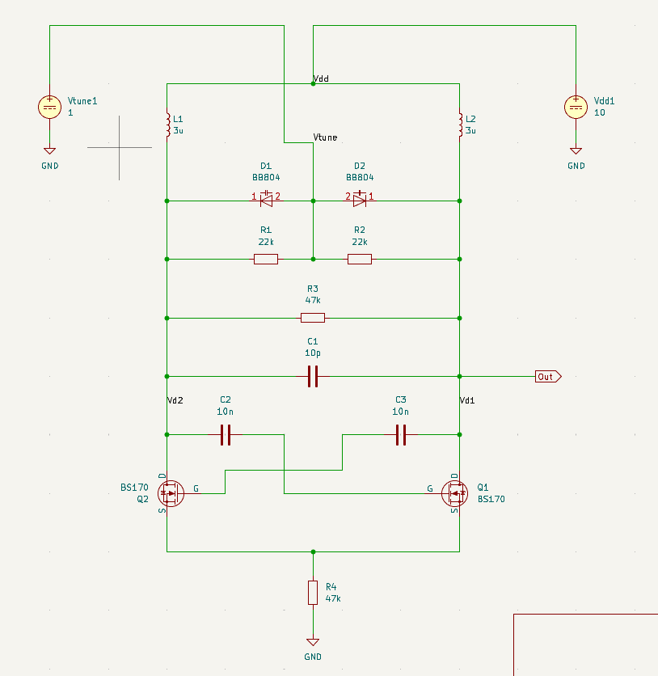

# Einleitung

Im Modul **Analoge Schaltungen (ANS)** soll ein analoger **Frequenzmodulator** entwickelt, simuliert und am Ende auch praktisch aufgebaut werden. Dafür wird eine Schaltung benötigt, bei der sich die Ausgangsfrequenz durch eine Eingangsspannung verändern lässt. Ein wichtiger Bestandteil davon ist ein spannungsgesteuerter Oszillator, also ein **VCO**.

Das Ziel des Projekts ist es, aus den vorgegebenen Anforderungen eine funktionierende Schaltung zu entwickeln. Dabei geht es nicht nur darum, dass die Schaltung in der Simulation funktioniert, sondern auch darum, dass sie später real aufgebaut und gemessen werden kann. Deshalb müssen neben der eigentlichen Frequenzänderung auch praktische Punkte wie die Spannungsversorgung, die Anpassung von Ein- und Ausgang, die Bandbreite und ein möglichst robuster Aufbau beachtet werden.

In dieser Dokumentation wird beschrieben, wie aus den Anforderungen ein Schaltungsentwurf entsteht, wie dieser simuliert wird und wie die Schaltung anschließend praktisch überprüft werden kann. Zudem wie wir uns darauf vorbereiten umd diesen Aufbau zu realisieren.

# Kundenanforderungen

Für den Frequenzmodulator wurden folgende Anforderungen vorgegeben:

- Mittenfrequenz von **5,5 MHz**
- Einstellbarer Frequenzbereich um die Mittenfrequenz
- Nutzbarer Frequenzbereich von **5 MHz bis 6 MHz**
- Frequenzhub von etwa **±1 MHz**
- Eingangssignal im Bereich von ungefähr **±0,5 V**
- Möglichst linearer Zusammenhang zwischen Eingangsspannung und Ausgangsfrequenz
- sehr kleine nichtlineare Abweichungen
- Ausreichend große Bandbreite für den Einsatz als Frequenzmodulator
- Ein Eingang und ein Ausgang (BNC-Buchsen)
- Ein- und Ausgang sollen auf **50 Ω** angepasst sein
- Frequenzdrift soll durch gleichspannung korrigierbar sein
- Robuste Platine für einen stabilen und übersichtlichen Aufbau
- Kennlinie soll über Gleichspannunnung ermittelt werden können
- Ausgangsspannung soll messbar sein
- Schaltung soll möglichst kurzschlusssicher sein


# Vorbereitung

Zu Beginn des Projekts haben wir uns zunächst in das Thema Frequenzmodulation und spannungsgesteuerte Oszillatoren (**VCOs**) eingearbeitet. Dafür haben wir eigene Recherchen durchgeführt, um die grundsätzliche Funktionsweise eines VCOs und seine Rolle in einem Frequenzmodulator besser zu verstehen.

Neben der theoretischen Vorbereitung war es auch wichtig, die benötigten Programme kennenzulernen. Für den Schaltungsentwurf und die Simulation verwenden wir **KiCad** und **ngspice**. Die Projektdokumentation wird mit **Quarto** erstellt. Da diese Programme später im Projektverlauf regelmäßig genutzt werden, mussten wir uns zunächst mit dem grundlegenden Arbeitsablauf vertraut machen.

## Laborübung 1: Einstieg in KiCad, ngspice und Quarto

In der ersten Laborübung ging es vor allem darum, die grundlegende Arbeitsweise mit **KiCad**, **ngspice** und **Quarto** kennenzulernen. Dafür wurde zunächst eine einfache Drain-Source-Schaltung mit einem **nMOS-Transistor BS170** in KiCad aufgebaut.

Anschließend wurde die Schaltung direkt in KiCad mit ngspice simuliert. Zusätzlich wurde die Netzliste aus KiCad exportiert und separat direkt in ngspice simuliert. Dadurch konnten wir den Unterschied zwischen der integrierten Simulation in KiCad und der direkten Simulation über ngspice nachvollziehen.

Die simulierten Daten aus beiden Vorgehensweisen wurden anschließend miteinander verglichen. Für diesen Vergleich wurden die exportierten Simulationsdaten mit Python eingelesen und grafisch dargestellt. Dadurch konnten wir überprüfen, ob beide Simulationswege zu denselben Ergebnissen führen und ob der Export der Netzliste korrekt funktioniert.


```{python}
import numpy as np
import matplotlib.pyplot as plt
import pandas as pd


# Daten einlesen
# KiCad Daten: v-sweep, I(Vdd1), V(/Vg)
data_kicad = pd.read_csv('data\\ANS_Uebung1_kicad.csv', delimiter=';', decimal=',')
v_sweep_kicad = data_kicad['v-sweep'].values
I_Vdd1_kicad = data_kicad['I(Vdd1)'].values
V_Vg_kicad = data_kicad['V(/Vg)'].values

# Ngspice Daten: v-sweep, V(/Vg), ?, I(Vdd1)
data_ngspice = np.loadtxt('data\\ANS_Uebung1_ngspice.csv')
v_sweep_ngspice = data_ngspice[:, 0]
V_Vg_ngspice = data_ngspice[:, 1]
I_Vdd1_ngspice = data_ngspice[:, 3]

# Vergleich: Plot I(Vdd1) vs v-sweep für beide
plt.figure(figsize=(10, 6))
plt.plot(v_sweep_kicad, I_Vdd1_kicad, label='KiCad I(Vdd1)', marker='o')
plt.plot(v_sweep_ngspice, I_Vdd1_ngspice, label='Ngspice I(Vdd1)', marker='x')
plt.xlabel('v-sweep (V)')
plt.ylabel('I(Vdd1) (A)')
plt.title('Vergleich von I(Vdd1) aus KiCad und Ngspice')
plt.legend()
plt.grid(True)
plt.show()

# Numerischer Vergleich: Differenz berechnen
diff_I = I_Vdd1_kicad - I_Vdd1_ngspice
plt.figure(figsize=(10, 6))
plt.plot(v_sweep_kicad, diff_I, label='Differenz I(Vdd1) KiCad - Ngspice', marker='s')
plt.xlabel('v-sweep (V)')
plt.ylabel('Differenz I(Vdd1) (A)')
plt.title('Differenz zwischen KiCad und Ngspice I(Vdd1)')
plt.legend()
plt.grid(True)
plt.show()

# Ausgabe der maximalen Differenz
max_diff = np.max(np.abs(diff_I))
print(f'Maximale absolute Differenz in I(Vdd1): {max_diff} A')
```


## Laborübungen 2 und 3: Simulation, Datenauswertung und erster LC-Oszillator

In den nächsten Laborübungen haben wir den Umgang mit Simulationen und der anschließenden Auswertung weiter geübt. Dabei ging es zuerst noch einmal um das Verhalten eines nMOS-Transistors. Danach wurde der Fokus auf eine erste Oszillatorschaltung gelegt, die für unseren späteren Frequenzmodulator eine wichtige Grundlage bildet.

Ein wichtiger Punkt war dabei der Umgang mit **RAW-Dateien**. Diese Dateien enthalten die Ergebnisse einer Simulation und können anschließend mit Python weiterverarbeitet werden. Dafür wurde die Bibliothek **PyLTSpice** verwendet. So konnten die Simulationsdaten nicht nur direkt in KiCad oder ngspice betrachtet, sondern auch mit eigenen Python-Skripten eingelesen und geplottet werden. Das ist für das Projekt hilfreich, weil wir spätere Simulationen besser vergleichen und auswerten können.

Anschließend haben wir in KiCad einen **LC-Oszillator mit kreuzgekoppeltem MOSFET-Paar** aufgebaut und simuliert. Die Schaltung besteht aus einem RLC-Schwingkreis und zwei nMOS-Transistoren vom Typ **BS170**. Die beiden Transistoren sind so miteinander verbunden, dass sie dem Schwingkreis Energie zurückführen. Dadurch werden die Verluste im Schwingkreis teilweise ausgeglichen und es kann eine dauerhafte Schwingung entstehen.

Die Frequenz der Schaltung wird hauptsächlich durch die Spule und die wirksame Kapazität im Schwingkreis bestimmt. Näherungsweise gilt dafür:

$$
f_0 = \frac{1}{2\pi\sqrt{LC}}
$$

An dieser Gleichung erkennt man, dass sich die Frequenz verändert, sobald sich die Kapazität oder die Induktivität ändert. In unserem Fall wurde die Kapazität verändert. Wird die Kapazität größer, sinkt die Frequenz. Wird die Kapazität kleiner, steigt die Frequenz. Genau dieser Zusammenhang ist später für einen VCO wichtig, weil dort die Frequenz gezielt über eine veränderbare Kapazität beeinflusst werden soll.

In der Simulation wurden deshalb verschiedene Kapazitätswerte eingesetzt und die Ausgangsspannung im Zeitbereich betrachtet. Aus dem Verlauf der Ausgangsspannung kann anschließend die Schwingfrequenz bestimmt werden. Damit lässt sich untersuchen, wie stark sich die Frequenz bei unterschiedlichen Kapazitäten verändert.

## Cross-Coupled VCO

Für unseren VCO haben wir eine Cross-Coupled-Schaltung mit zwei BS170-MOSFETs aufgebaut und in SPICE simuliert. Ziel war es, einen spannungsgesteuerten Oszillator mit einer Mittenfrequenz von

$$
f_0 = 5{,}5\,\text{MHz}
$$

zu realisieren. Zusätzlich sollte der Frequenzhub ungefähr

$$
\Delta f = \pm 0{,}5\,\text{MHz}
$$

betragen. Damit sollte der VCO insgesamt in einem Bereich von ungefähr

$$
5{,}0\,\text{MHz} \leq f \leq 6{,}0\,\text{MHz}
$$

abstimmbar sein.

Der aktuelle Schaltungsaufbau ist in @fig-crosscoupled-vco dargestellt.

{#fig-crosscoupled-vco width=80%}

Der Schwingkreis besteht aus den beiden Spulen $L_1$ und $L_2$, dem festen Kondensator $C_1$ und den beiden Varaktordioden $D_1$ und $D_2$. Als Transistoren werden zwei BS170-MOSFETs verwendet. Die Frequenz soll über die Spannung $V_\text{tune}$ verändert werden, da diese die Kapazität der Varaktordioden beeinflussen soll.

Die aktuell verwendeten Bauteilwerte sind:

| Bauteil | Wert / Typ |
|---|---:|
| $L_1$ | $3\,\mu\text{H}$ |
| $L_2$ | $3\,\mu\text{H}$ |
| $C_1$ | $10\,\text{pF}$ |
| $C_2$ | $10\,\text{nF}$ |
| $C_3$ | $10\,\text{nF}$ |
| $R_1$ | $22\,\text{k}\Omega$ |
| $R_2$ | $22\,\text{k}\Omega$ |
| $R_3$ | $47\,\text{k}\Omega$ |
| $R_4$ | $47\,\text{k}\Omega$ |
| $Q_1$, $Q_2$ | BS170 |
| $D_1$, $D_2$ | aktuell BB804, vorher BB112 |
| $V_{DD}$ | $10\,\text{V}$ |

Die Resonanzfrequenz eines idealen LC-Schwingkreises kann mit

$$
f = \frac{1}{2\pi\sqrt{LC}}
$$

berechnet werden. Da die Schaltung symmetrisch aufgebaut ist, wurde die wirksame Induktivität näherungsweise als Summe der beiden Spulen angenommen:

$$
L_\text{diff} \approx L_1 + L_2
$$

Mit

$$
L_1 = L_2 = 3\,\mu\text{H}
$$

ergibt sich somit

$$
L_\text{diff} \approx 6\,\mu\text{H}
$$

Für die gewünschte Mittenfrequenz von $5{,}5\,\text{MHz}$ kann daraus die benötigte Kapazität berechnet werden:

$$
C = \frac{1}{(2\pi f)^2L}
$$

Daraus ergibt sich ungefähr:

$$
C \approx 140\,\text{pF}
$$

Für den gewünschten Frequenzbereich ergeben sich damit folgende ungefähre Werte:

| Frequenz | notwendige wirksame Kapazität |
|---:|---:|
| $5{,}0\,\text{MHz}$ | ca. $169\,\text{pF}$ |
| $5{,}5\,\text{MHz}$ | ca. $140\,\text{pF}$ |
| $6{,}0\,\text{MHz}$ | ca. $117\,\text{pF}$ |

Der Schwingkreis müsste also ungefähr zwischen $117\,\text{pF}$ und $169\,\text{pF}$ abstimmbar sein.

In der Simulation konnten wir die Schaltung inzwischen grundsätzlich zum Schwingen bringen. Allerdings wird die gewünschte Funktion als VCO noch nicht vollständig erreicht. Die Schaltung schwingt zwar, jedoch ist die Abstimmung über die Steuerspannung noch nicht zufriedenstellend. Außerdem ist die Amplitude noch nicht stabil, sondern zeigt teilweise deutliche Schwankungen beziehungsweise Störungen.

Bei der Auswahl der Varaktordioden zeigte sich in der Simulation ein unerwartetes Verhalten. Von den vorhandenen SPICE-Modellen führte bisher nur die BB112 zu einer deutlich sichtbaren Frequenzänderung bei Veränderung der Abstimmspannung. Bei den anderen getesteten Varaktormodellen änderte sich die Frequenz dagegen kaum oder praktisch gar nicht. Deshalb ist noch unklar, ob dieses Verhalten an den realen Kapazitätswerten der Dioden, an der Beschaltung oder an den verwendeten SPICE-Modellen liegt. Mit der BB112 konnte zwar grundsätzlich eine Frequenzänderung simuliert werden, allerdings lag der resultierende Frequenzbereich nicht im gewünschten Bereich. 

Ein weiteres auffälliges Verhalten bei der BB112 war, dass sich die Abstimmung scheinbar verkehrt herum verhält. Bei einer Abstimmspannung von $8\,\text{V}$ ergab sich eine niedrigere Frequenz als bei $1\,\text{V}$. Normalerweise würde man bei einer Varaktordiode erwarten, dass eine größere Sperrspannung zu einer kleineren Kapazität und damit zu einer höheren Frequenz führt:

$$
V_R \uparrow \quad \Rightarrow \quad C_D \downarrow \quad \Rightarrow \quad f \uparrow
$$


Aktuell wurde statt der BB112 eine BB804 eingesetzt. Mit dieser Diode schwingt die Schaltung bei ungefähr

$$
f \approx 5{,}998\,\text{MHz}
$$

und liegt damit grundsätzlich sehr nah am gewünschten oberen Frequenzbereich. Allerdings zeigt sich bei der BB804 in der Simulation praktisch keine nutzbare Abstimmung über die Spannung $V_\text{tune}$. Sowohl bei

$$
V_\text{tune} = 1\,\text{V}
$$

als auch bei

$$
V_\text{tune} = 8\,\text{V}
$$

bleibt die Grundfrequenz nahezu gleich. Die eigentliche Grundschwingung verändert sich also kaum.

Auffällig ist jedoch, dass bei einer Abstimmspannung von $8\,\text{V}$ zusätzliche Störungen beziehungsweise Unregelmäßigkeiten im Signal auftreten. Die Grundfrequenz bleibt dabei ungefähr gleich, aber das Signal wirkt weniger sauber. Damit eignet sich die aktuelle BB804-Beschaltung zwar, um eine Schwingung nahe $6\,\text{MHz}$ zu erzeugen, aber noch nicht für einen echten spannungsgesteuerten Frequenzhub.


$$
5{,}0\,\text{MHz} \leq f \leq 6{,}0\,\text{MHz}
$$

ergibt. Mit der aktuell eingesetzten BB804 wird dieser Frequenzhub in der Simulation jedoch noch nicht erreicht.

Auffällig ist, dass die gewünschte Frequenz von ungefähr $6\,\mathrm{MHz}$ in der Simulation bereits mit einem festen Kondensator von $C_1 = 10\,\mathrm{pF}$ erreicht wird. Nach der idealen Berechnung müsste die wirksame Gesamtkapazität des Schwingkreises bei $6\,\mathrm{MHz}$ jedoch ungefähr $C_\mathrm{ges} \approx 117\,\mathrm{pF}$ betragen. Daraus folgt, dass $C_1$ nicht die einzige wirksame Kapazität im Schwingkreis ist.


Zusammenfassend schwingt der Cross-Coupled VCO inzwischen grundsätzlich, erfüllt die geforderte Spezifikation aber noch nicht vollständig. Mit der BB804 wird zwar eine Frequenz nahe $6\,\text{MHz}$ erreicht, jedoch fehlt noch die gewünschte Frequenzänderung über die Abstimmspannung. Mit der BB112 konnte eine Frequenzänderung beobachtet werden, allerdings lag der Frequenzbereich nicht passend und die Diode beeinflusste den Schwingkreis sehr stark. Die wichtigsten offenen Punkte sind daher die fehlende beziehungsweise zu geringe Abstimmwirkung der Varaktordiode, die instabile Amplitude und die weitere Optimierung des Arbeitspunktes. 