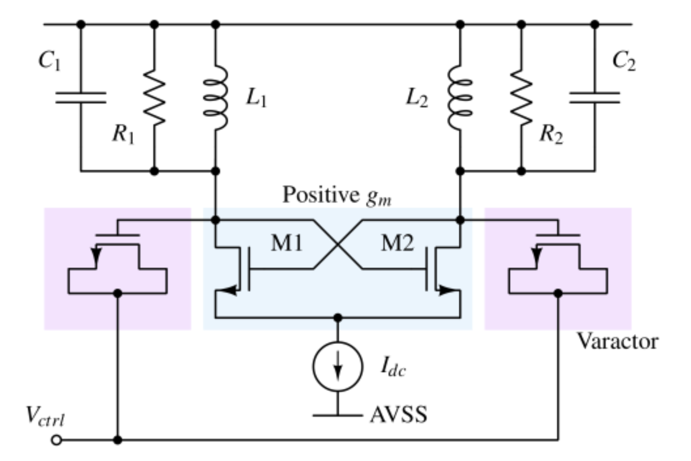
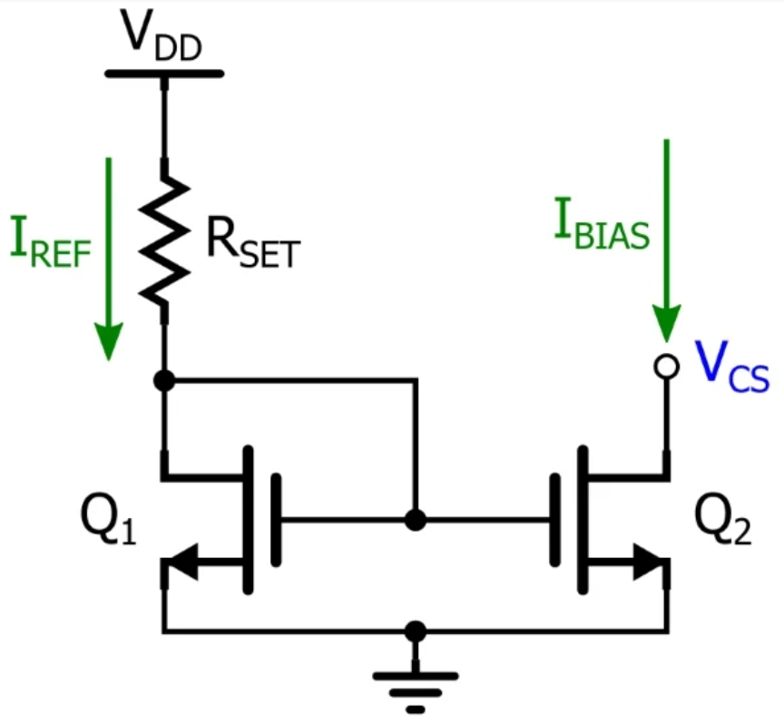
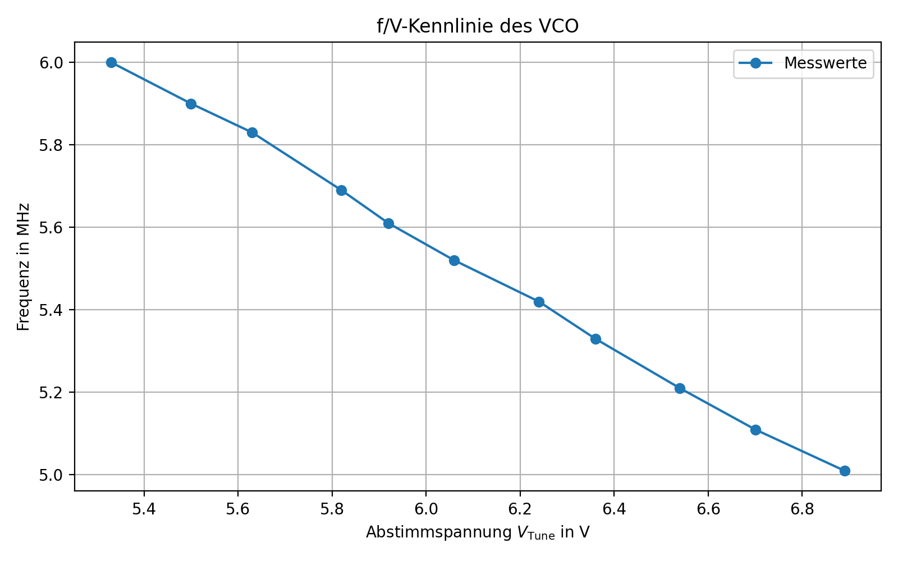
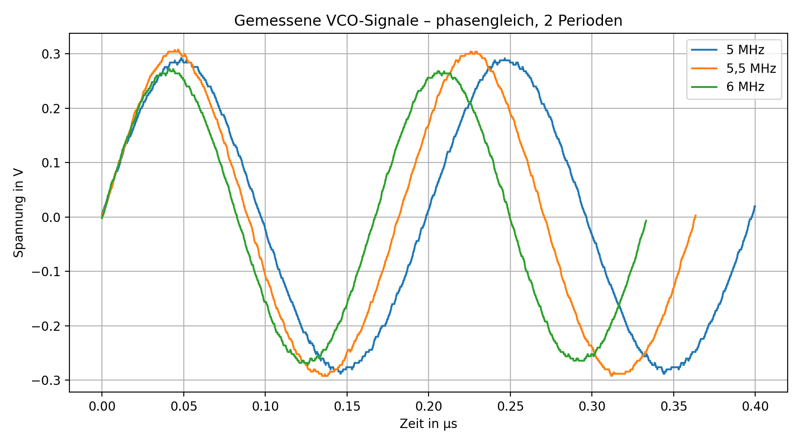
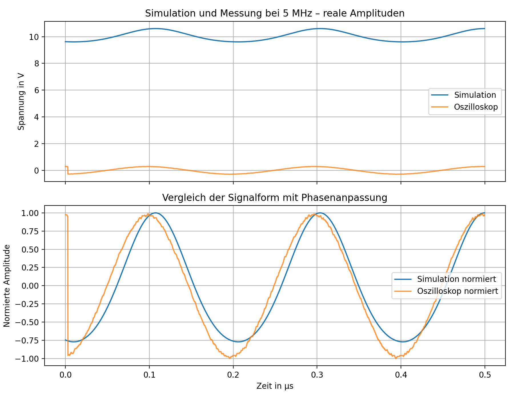
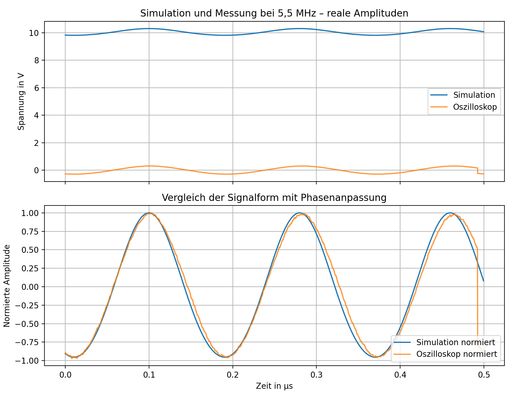
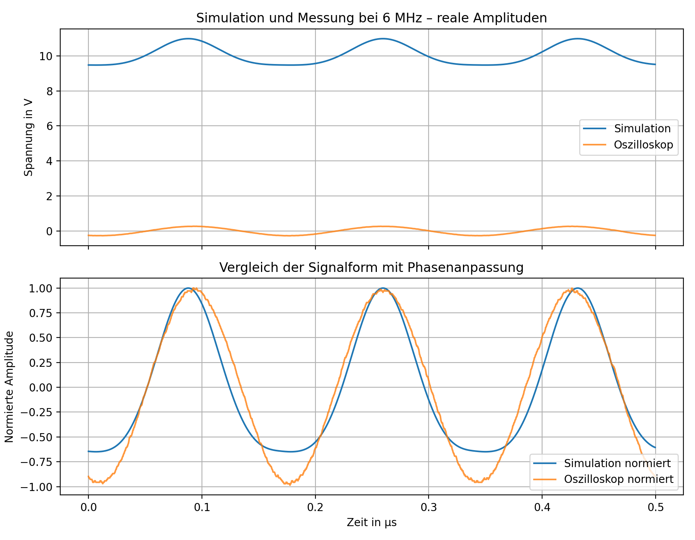

# FM-VCO

Dieses Repository enthält die Entwicklung, Simulation und praktische Umsetzung eines spannungsgesteuerten Oszillators für einen Frequenzmodulator.

Der VCO wird in **KiCad** aufgebaut und mit **ngspice** simuliert. Anschließend soll die Schaltung auf einer Platine umgesetzt und messtechnisch untersucht werden.

## Kundenanforderungen

Für den Frequenzmodulator wurden folgende Anforderungen vorgegeben:

- Mittenfrequenz von **5,5 MHz**
- Eingangssignal von **0 V**
- lineare Frequenzänderung von **±0,5 MHz**
- nutzbarer Frequenzbereich von **5 MHz bis 6 MHz**
- möglichst geringe nichtlineare Verzerrungen
- robuste und übersichtliche Platine für den Einsatz im Unterricht
- Verwendung möglichst großer und gut handhabbarer Bauteile
- integrierter Spannungsteiler zur Einstellung des Arbeitspunktes
- Ein- und Ausgang über BNC-Buchsen
- Ausgangswiderstand von **50 Ω**
- Korrektur einer Frequenzdrift über eine einstellbare Gleichspannung
- Aufnahme der Frequenzkennlinie mithilfe einer Gleichspannung
- möglichst kurzschlusssicherer Ausgang

## Grundlagen und Aufbau des VCOs

### Vom Schwingkreis zum Oszillator

Die Grundlage des VCOs bildet ein LC-Schwingkreis aus Induktivitäten und Kapazitäten. Im Schwingkreis wird Energie periodisch zwischen dem magnetischen Feld der Induktivitäten und dem elektrischen Feld der Kapazitäten ausgetauscht.

Die Resonanzfrequenz kann näherungsweise mit

$$
f_0 \approx \frac{1}{2\pi\sqrt{L_\text{}C_\text{}}}
$$

beschrieben werden.

Dabei sind:

- $L_\text{}$ die wirksame Induktivität des Schwingkreises
- $C_\text{}$ die gesamte wirksame Kapazität einschließlich parasitärer Kapazitäten

Ein realer LC-Schwingkreis besitzt Verluste, beispielsweise durch die Innenwiderstände der Induktivitäten, Leiterbahnen und angeschlossene Messgeräte. Ohne zusätzliche Energiezufuhr würde die Schwingung deshalb mit der Zeit abklingen.

Damit eine dauerhafte Schwingung entsteht, muss eine aktive Schaltung die Verluste des Schwingkreises ausgleichen. Dazu wird ein Teil des Ausgangssignals phasenrichtig zurückgeführt und verstärkt. Beim Einschalten reichen bereits kleine Störungen und das elektrische Rauschen aus, um eine Schwingung anzuregen. Die Frequenzanteile in der Nähe der Resonanzfrequenz werden anschließend durch die Rückkopplung verstärkt.

Für das Anschwingen muss die Schleifenverstärkung zunächst ausreichend groß sein. Im eingeschwungenen Zustand stellt sich die Amplitude so ein, dass die zugeführte Energie den Verlusten des Schwingkreises entspricht.

### Aufbau des VCOs

Der verwendete VCO besteht grundsätzlich aus einem differentiellen LC-Schwingkreis, einem gekreuzt gekoppelten MOSFET-Paar und einer Stromquelle.

<p align="center">
  
</p>

<p align="center">
  <em>
    Vereinfachter Aufbau eines differentiellen LC-VCOs.
    Quelle:
    <a href="https://analogcircuitdesign.com/voltage-controlled-oscillator/">
      Analog Circuit Design
    </a>
  </em>
</p>

Der VCO setzt sich aus folgenden Funktionsgruppen zusammen:

| Funktionsgruppe | Bauteile der Prinzipschaltung | Bauteile der aktuellen Schaltung | Aufgabe |
|---|---|---|---|
| LC-Schwingkreis | `L1`, `L2`, `C1`, `C2` sowie die Verlustwiderstände `R1`, `R2` | `L1`, `L2`, `D1`, `D2` | Festlegung der Resonanzfrequenz |
| Cross-Coupled-Paar | `M1`, `M2` | `Q1`, `Q2` | Ausgleich der Schwingkreisverluste und Aufrechterhaltung der Schwingung |
| Frequenzabstimmung | Varaktordioden und Steuerspannung `Vctrl` | `D1`, `D2` und Abstimmspannung `Vtune` | Veränderung der wirksamen Kapazität und damit der Ausgangsfrequenz |
| Stromquelle | ideale Stromquelle `Idc` | `Q3`, `Q4`, `R4` | Einstellung und Begrenzung des Arbeitspunktstroms |
| Ausgang | einer der beiden Schwingkreisknoten | rechter Schwingkreisknoten | Ausgabe des hochfrequenten Signals |

In der Prinzipschaltung werden die Verluste des LC-Schwingkreises durch die Parallelwiderstände `R1` und `R2` dargestellt. In der realen Schaltung entstehen diese Verluste bereits durch die Innenwiderstände der Spulen, die Varaktordioden, die MOSFETs und die Leiterbahnen. Deshalb wurden keine zusätzlichen Widerstände parallel zum Schwingkreis eingesetzt.

Die Kondensatoren `C1` und `C2` der Prinzipschaltung werden in der aktuellen Schaltung hauptsächlich durch die spannungsabhängigen Kapazitäten der Varaktordioden `D1` und `D2` ersetzt.

Der LC-Schwingkreis bestimmt die Ausgangsfrequenz. Das Cross-Coupled-Transistorpaar führt dem Schwingkreis die durch reale Verluste abgegebene Energie wieder zu. Die Varaktordioden ermöglichen die spannungsabhängige Frequenzeinstellung über `Vtune`.

Als Stromquelle wird ein einfacher NMOS-Stromspiegel verwendet. Dieser stellt den Arbeitspunktstrom für das Cross-Coupled-Transistorpaar bereit.

Die einzelnen Funktionsgruppen werden in den folgenden Abschnitten genauer beschrieben.
### Cross-Coupled-Transistorpaar

Die MOSFETs `Q1` und `Q2` sind über Kreuz miteinander gekoppelt. Das Gate eines Transistors ist jeweils mit dem Drain des anderen Transistors verbunden.

Die beiden Schwingkreisknoten schwingen dadurch näherungsweise gegenphasig. Steigt die Spannung an einem Knoten an, fällt sie am anderen Knoten ab.

Das Transistorpaar erzeugt im Schwingkreis einen negativen differentiellen Widerstand. Dieser wirkt den realen Verlustwiderständen des Schwingkreises entgegen. Sind die Verluste ausreichend kompensiert, kann die Schwingung dauerhaft bestehen bleiben.

### Spannungsabhängige Frequenzabstimmung

Damit aus dem LC-Oszillator ein spannungsgesteuerter Oszillator wird, werden die festen Kapazitäten durch Varaktordioden ersetzt.

Eine Varaktordiode wird in Sperrrichtung betrieben und verhält sich dabei wie ein spannungsabhängiger Kondensator. Die Abstimmspannung `Vtune` verändert die Sperrspannung und damit die Kapazität der Dioden.

Dadurch verändert sich die wirksame Kapazität des Schwingkreises:

$$
V_\text{tune}
\longrightarrow
C_\text{Varaktor}
\longrightarrow
f_\text{out}
$$

In der aktuellen Schaltung nimmt die gemessene Ausgangsfrequenz mit zunehmender Spannung `Vtune` ab. Die genaue Richtung der Frequenzänderung hängt von der Verschaltung der Varaktordioden und den Spannungsverhältnissen innerhalb des Schwingkreises ab.

Für einen möglichst verzerrungsarmen Frequenzmodulator sollte der Zusammenhang zwischen Abstimmspannung und Ausgangsfrequenz im verwendeten Arbeitsbereich möglichst linear sein:

$$
f_\text{out}
\approx
f_\text{Mitte}
+
K_\text{VCO}\cdot\left(V_\text{tune}-V_\text{Mitte}\right)
$$

Dabei beschreibt $K_\text{VCO}$ die Empfindlichkeit des VCOs und wird beispielsweise in `MHz/V` angegeben.

### NMOS-Stromspiegel

Die Stromquelle des VCOs wird als einfacher NMOS-Stromspiegel ausgeführt.

<p align="center">
  
</p>

<p align="center">
  <em>
    Prinzip eines einfachen NMOS-Stromspiegels.
    Quelle:
    <a href="https://www.allaboutcircuits.com/technical-articles/the-basic-mosfet-constant-current-source/">
      All About Circuits
    </a>
  </em>
</p>

Der Stromspiegel besteht in der aktuellen Schaltung aus den MOSFETs `Q3` und `Q4` sowie dem Widerstand `R4`.

Bei `Q4` sind Gate und Drain miteinander verbunden. Der Transistor ist damit als Referenztransistor beschaltet. Über den Widerstand `R4` stellt sich ein Referenzstrom ein.

Da die Gates von `Q3` und `Q4` miteinander verbunden sind, liegt an beiden MOSFETs näherungsweise dieselbe Gate-Source-Spannung an. Dadurch übernimmt `Q3` näherungsweise den Strom des Referenzzweigs und stellt den Arbeitspunktstrom für das Cross-Coupled-Transistorpaar bereit.

Die Bauteile der Prinzipschaltung entsprechen in der aktuellen VCO-Schaltung folgenden Bauteilen:

| Prinzipschaltung | Aktuelle Schaltung |
|---|---|
| Referenztransistor `Q1` | `Q4` |
| Ausgangstransistor `Q2` | `Q3` |
| Einstellwiderstand `RSET` | `R4` |
| Referenzstrom `IREF` | Strom durch `R4` und `Q4` |
| Ausgangsstrom `IBIAS` | Arbeitspunktstrom für `Q1` und `Q2` |

Der Referenzstrom kann vereinfacht mit folgender Gleichung abgeschätzt werden:

$$
I_\text{REF}
\approx
\frac{V_\text{DD}-V_\text{GS}}{R_4}
$$

Diese Gleichung ist nur eine Näherung, da die Gate-Source-Spannung `VGS` vom verwendeten MOSFET, vom Strom und von der Temperatur abhängt.

Der Stromspiegel stabilisiert damit den Arbeitspunkt der Schaltung, stellt jedoch keine vollständige automatische Regelung der Ausgangsamplitude dar.

## Verwendete Bauteile

Für den aktuellen Aufbau werden unter anderem folgende Bauteile verwendet:

| Bezeichnung | Bauteil | Funktion | Datenblatt |
|---|---|---|---|
| Q1, Q2 | [`BS170`](https://www.onsemi.com/download/data-sheet/pdf/mmbf170-d.pdf) | Cross-Coupled-Transistorpaar | [](https://www.onsemi.com/download/data-sheet/pdf/mmbf170-d.pdf) |
| Q3, Q4 | [`BS170`](https://www.onsemi.com/download/data-sheet/pdf/mmbf170-d.pdf) | NMOS-Stromspiegel | [](https://www.onsemi.com/download/data-sheet/pdf/mmbf170-d.pdf) |
| D1, D2 | [`1SV149`](https://www.radiomuseum.co.uk/filter/1SV149.pdf) | Varaktordioden zur Frequenzabstimmung | [](https://www.radiomuseum.co.uk/filter/1SV149.pdf) |
| L1, L2 | 3,3 µH | Induktiver Teil des Schwingkreises | – |
| R4 | 51 kΩ | Einstellung des Referenzstroms im realen Aufbau | – |

Die Bauteilwerte können sich während der weiteren Entwicklung und Optimierung noch ändern.

## Abweichungen zwischen Simulation und realem Aufbau

Für den NMOS-Stromspiegel werden in der Simulation und im realen Aufbau unterschiedliche Widerstandswerte verwendet. Im realen Aufbau wird ein Widerstand von **51 kΩ** eingesetzt. Bei einem größeren Widerstand ist der Strom zu gering, sodass der Oszillator nicht zuverlässig zu schwingen beginnt. In der SPICE-Simulation wird dagegen ein größerer Widerstand benötigt, da kleinere Widerstandswerte zu Verzerrungen des Ausgangssignals führen.

Im realen Aufbau wurden außerdem Kondensatoren parallel zur Spannungsversorgung geschaltet. Diese dienen als Abblock- beziehungsweise Stützkondensatoren und reduzieren hochfrequente Störungen sowie kurzzeitige Spannungsschwankungen.

## Aktueller Stand

Der VCO wurde sowohl in **SPICE simuliert** als auch **praktisch aufgebaut**. Der geforderte nutzbare Frequenzbereich von ungefähr **5 MHz bis 6 MHz** wird bereits erreicht.

Die Ausgangsfrequenz wird über die Abstimmspannung `Vtune` eingestellt. Mit steigender Abstimmspannung sinkt die Ausgangsfrequenz. Die aufgenommenen Messwerte zeigen dabei einen nahezu linearen Zusammenhang zwischen `Vtune` und der Ausgangsfrequenz.

### Gemessene f/V-Kennlinie

Die Kennlinie wurde aufgenommen, indem die Gleichspannung `Vtune` schrittweise verändert und die jeweilige Ausgangsfrequenz gemessen wurde.

| `Vtune` in V | Frequenz in MHz |
|---:|---:|
| 5,33 | 6,00 |
| 5,50 | 5,90 |
| 5,63 | 5,83 |
| 5,82 | 5,69 |
| 5,92 | 5,61 |
| 6,06 | 5,52 |
| 6,24 | 5,42 |
| 6,36 | 5,33 |
| 6,54 | 5,21 |
| 6,70 | 5,11 |
| 6,89 | 5,01 |

<p align="center">
  
</p>

<p align="center">
  <em>Gemessene Ausgangsfrequenz in Abhängigkeit von der Abstimmspannung Vtune</em>
</p>

Die VCO-Empfindlichkeit beträgt näherungsweise:

$$
K_\text{VCO}
\approx
-0{,}650\,
\frac{\text{MHz}}{\text{V}}
$$

Das negative Vorzeichen bedeutet, dass die Ausgangsfrequenz mit steigender Abstimmspannung abnimmt.

Die Mittenfrequenz von ungefähr **5,5 MHz** wird bei einer Abstimmspannung von etwa **6,1 V** erreicht.

Für den gesamten Frequenzbereich von ungefähr **5 MHz bis 6 MHz** wird eine Spannungsänderung von etwa

$$
\Delta V_\text{tune} = 6{,}89\,\text{V} - 5{,}33\,\text{V} = 1{,}56\,\text{V}
$$

benötigt.

Bezogen auf den Arbeitspunkt bei ungefähr **6,1 V** entspricht dies einem benötigten Spannungshub von ungefähr:

$$
V_\text{tune}
\approx
6{,}1\,\text{V}
\pm
0{,}78\,\text{V}
$$

Der ursprünglich vorgesehene Eingangsspannungsbereich von ungefähr **±0,5 V** reicht daher ohne eine zusätzliche Anpassung nicht für den vollständigen Frequenzbereich aus.

### Gemessene Ausgangssignale

Die folgende Abbildunge zeigt die letzten zwei Perioden des mit dem Oszilloskop aufgenommenen Ausgangssignals.

#### Messung bei 5 MHz

<p align="center">
  
</p>

<p align="center">
  <em>Gemessenes Ausgangssignal bei 5 - 6 MHz</em>
</p>

Die gemessenen Signale besitzen über den untersuchten Frequenzbereich eine weitgehend sinusförmige Signalform.

Die Ausgangsamplitude ist bei **5 MHz** und **5,5 MHz** ähnlich groß. In Richtung **6 MHz** nimmt die Amplitude jedoch sichtbar ab. Die Ursache dafür muss im weiteren Projektverlauf noch untersucht werden.

### Simulation und Vergleich

Für die Frequenzen **5 MHz**, **5,5 MHz** und **6 MHz** wurden die simulierten Ausgangssignale mit den Oszilloskopmessungen verglichen.


<details>
  <summary><strong>Vergleich bei 5 MHz anzeigen</strong></summary>

  #### Vergleich bei 5 MHz

  <p align="center">
    
  </p>
</details>

<details>
  <summary><strong>Vergleich bei 5,5 MHz anzeigen</strong></summary>

  #### Vergleich bei 5,5 MHz

  <p align="center">
    
  </p>
</details>

<details>
  <summary><strong>Vergleich bei 6 MHz anzeigen</strong></summary>

  #### Vergleich bei 6 MHz

  <p align="center">
    
  </p>
</details>

Die normierten Vergleichsplots zeigen, dass Simulation und Messung grundsätzlich eine ähnliche periodische Signalform besitzen.


Die Simulation beschreibt damit das grundsätzliche Schwingverhalten, bildet den realen Arbeitspunkt und die tatsächliche Ausgangsamplitude jedoch nur eingeschränkt ab.

### Unterschiede zwischen Simulation und realem Aufbau

Für den NMOS-Stromspiegel werden in der Simulation und im realen Aufbau unterschiedliche Widerstandswerte benötigt.

Im realen Aufbau wird für `R4` ein Widerstand von **51 kΩ** verwendet. Bei größeren Widerständen ist der Strom zu gering, sodass der Oszillator nicht zuverlässig anschwingt.

In der SPICE-Simulation wird dagegen ein größerer Widerstand benötigt, da kleinere Widerstandswerte dort zu stärkeren Verzerrungen des Ausgangssignals führen.

Zusätzlich wurden im realen Aufbau Kondensatoren parallel zur Spannungsversorgung eingesetzt. Diese dienen als Abblock- und Stützkondensatoren und reduzieren hochfrequente Störungen sowie kurzzeitige Spannungsschwankungen.

### Platinenlayout

Eine erste Platine wurde bereits in KiCad erstellt. Das Layout muss jedoch noch an den aktuellen Schaltungsstand angepasst und weiter optimiert werden.

Besonders berücksichtigt werden müssen:

- Platzierung der Abblockkondensatoren nahe an den MOSFETs
- Ein- und Ausgangsanpassung

## Noch nicht vollständig erfüllte Anforderungen

Der geforderte Frequenzbereich von ungefähr **5 MHz bis 6 MHz** und die Mittenfrequenz von ungefähr **5,5 MHz** werden bereits erreicht. Auch die Frequenzkennlinie wurde mithilfe einer veränderlichen Gleichspannung aufgenommen und zeigt im untersuchten Bereich einen nahezu linearen Verlauf.

Folgende Kundenanforderungen sind noch nicht vollständig erfüllt:

- Anpassung des externen Eingangs auf einen Arbeitspunkt von **0 V**
- Umsetzung einer Frequenzänderung von ungefähr **±0,5 MHz** bei einem Eingangssignal von **±0,5 V**
- Integration eines Spannungsteilers beziehungsweise einer geeigneten Schaltung zur Einstellung des internen Arbeitspunktes
- weitere Verringerung beziehungsweise genaue Bewertung der nichtlinearen Verzerrungen
- Anpassung und Optimierung des bereits erstellten Platinenlayouts
- Realisierung eines Ausgangswiderstands von **50 Ω**
- Umsetzung und Prüfung der Korrektur einer Frequenzdrift über eine einstellbare Gleichspannung
- möglichst kurzschlusssichere Auslegung des Ausgangs
- Aufbau und Prüfung der endgültigen Platine

## Verwendete Software

Für die Entwicklung, Simulation und Versionsverwaltung werden folgende Programme verwendet:

| Software | Verwendung | Download |
|---|---|---|
| KiCad | Erstellung des Schaltplans und des Platinenlayouts | [](https://www.kicad.org/download/) |
| ngspice | Simulation der Schaltung und Untersuchung des VCO-Verhaltens | [](https://ngspice.sourceforge.io/download.html) |
| Git | Lokale Versionsverwaltung des Projekts | [](https://git-scm.com/install/) |
| GitHub | Speicherung und gemeinsame Bearbeitung des Repositorys | [](https://github.com/) |

KiCad verwendet für die integrierte SPICE-Simulation ngspice. Abhängig von der KiCad-Installation kann ngspice daher bereits enthalten sein.

## Projekt öffnen

Das Repository kann mit folgendem Befehl geklont werden:

```bash
git clone <URL-DES-REPOSITORY>
```

Der aktuelle Stand des KiCad-Projekts befindet sich im folgenden Unterordner:

```text
kicad/FM-ELK_LC-VCO-FINAL
```

Anschließend kann die darin enthaltene `.kicad_pro`-Datei mit KiCad geöffnet werden.

Vor der Simulation sollte überprüft werden, ob:

- alle Symbolbibliotheken vorhanden sind
- alle Footprints korrekt zugeordnet sind
- das SPICE-Modell der `1SV149` eingebunden ist
- die Modellpfade in KiCad korrekt eingestellt sind

## Projektteam

<p>
  <a href="https://github.com/madraeger">
    
  </a>
  <a href="https://github.com/ethaniellingkoenig">
    
  </a>
</p>

## Literaturverzeichnis

Die folgenden Quellen wurden für die Grundlagen und die Entwicklung der Schaltung verwendet:

1. [Analog Circuit Design: Voltage Controlled Oscillator – VCO Basics, Operation, Tuning and Use in Communication Circuits](https://analogcircuitdesign.com/voltage-controlled-oscillator/)  
   Grundlagen zu spannungsgesteuerten Oszillatoren, LC-VCOs, Varaktordioden und VCO-Kennlinien.

2. [Electronics Tutorials: LC Oscillator Tutorial and Tuned LC Oscillator Basics](https://www.electronics-tutorials.ws/oscillator/oscillators.html)  
   Grundlagen zu LC-Schwingkreisen, Rückkopplung und den Bedingungen für eine dauerhafte Schwingung.

3. [ElektronikTutor: Frequenzmodulation](https://www.elektroniktutor.de/signalkunde/fm.html)  
   Grundlagen zur Frequenzmodulation, zum Frequenzhub, zum Modulationsindex und zur Bandbreite eines FM-Signals.

4. [All About Circuits: The Basic MOSFET Constant-Current Source](https://www.allaboutcircuits.com/technical-articles/the-basic-mosfet-constant-current-source/)  
   Grundlagen zur MOSFET-Stromquelle und zum Stromspiegel.

Alle Internetquellen wurden zuletzt am **18. Juli 2026** abgerufen.